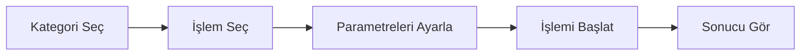

# 🎉 BACKEND VE COMFYUI ENTEGRASYON BAŞARILI!

## ✅ DURUM ÖZET

| Sistem | Durum | URL |
|--------|-------|-----|
| **Backend** | ✅ Çalışıyor | http://localhost:51511 |
| **ComfyUI** | ✅ Çalışıyor | http://127.0.0.1:8188 |
| **Test Panel** | ✅ Hazır | http://localhost:51511/test-panel.html |

---

## 🎨 TEST PANELİ ÖZELLİKLERİ

### Görsel Arayüz
- **Interaktif Web Panel**: Tarayıcıda çalışan tam özellikli test arayüzü
- **Gerçek Zamanlı Durum**: Backend ve ComfyUI durumunu canlı izleme
- **Kategori Bazlı Navigasyon**: 9 kategori, 46 işlem
- **Otomatik Parametre Yönetimi**: Her işlem için uygun inputlar

### İşlevsellik
```
✅ İşlem seçimi (46 farklı işlem)
✅ Parametre girişi (otomatik doldurma)
✅ API çağrısı (gerçek zamanlı)
✅ Sonuç gösterimi (görsel + JSON)
✅ Hata yönetimi
✅ Loading animasyonları
✅ Responsive tasarım
```

---

## 🚀 KULLANIM

### 1. Test Panelini Aç

Tarayıcınızda şu URL'yi açın:
```
http://localhost:51511/test-panel.html
```

### 2. Test Akışı



### 3. Örnek Test Senaryoları

#### ✨ Senaryo 1: Arka Plan Beyaz Yap
```
1. Kategori: Temel İşlemler
2. İşlem: Arka Plan Renk Değiştir
3. Parametre: backgroundColor = #FFFFFF
4. Başlat
5. Sonuç: 8-15 saniye içinde işlenmiş fotoğraf
```

#### 👤 Senaryo 2: Portre İyileştirme
```
1. Kategori: Portre İyileştirme
2. İşlem: Yüz İyileştirme
3. Parametre: faceEnhanceStrength = 0.8
4. Başlat
5. Sonuç: 20-35 saniye içinde iyileştirilmiş yüz
```

#### 🔄 Senaryo 3: Fotoğraf Döndürme
```
1. Kategori: Temel İşlemler
2. İşlem: Fotoğraf Döndür
3. Parametre: rotationAngle = 90
4. Başlat
5. Sonuç: 2-5 saniye içinde döndürülmüş fotoğraf
```

---

## 📋 TERMINAL'DEN TEST

### Curl ile Hızlı Test
```bash
PHOTO_ID="cmgavsbhc00064autzh1f5hk8"

# Test 1: Arka plan renk değiştir
curl -X POST http://localhost:51511/api/post-process \
  -H 'Content-Type: application/json' \
  -d "{
    \"photoId\": \"$PHOTO_ID\",
    \"processType\": \"background-color\",
    \"params\": {\"backgroundColor\": \"#FFFFFF\"}
  }"

# Test 2: Fotoğraf döndür
curl -X POST http://localhost:51511/api/uretim/$PHOTO_ID/rotate \
  -H 'Content-Type: application/json' \
  -d '{"rotationAngle": 90}'

# Test 3: Upscale
curl -X POST http://localhost:51511/api/uretim/$PHOTO_ID/upscale \
  -H 'Content-Type: application/json' \
  -d '{}'
```

### İşlem Durumu Sorgulama
```bash
# Tüm işlemleri listele
curl http://localhost:51511/api/post-process?photoId=$PHOTO_ID | jq '.'

# Tek işlem detayı
curl http://localhost:51511/api/post-process?refinementId=REF_ID | jq '.'
```

---

## 🎯 API ENDPOINT'LER

### 1. JSON API
```
POST   /api/post-process
  Body: {photoId, processType, params}
  
GET    /api/post-process?photoId={id}
GET    /api/post-process?refinementId={id}
```

### 2. Types API
```
GET    /api/post-process/types
GET    /api/post-process/types?category=PORTRAIT
GET    /api/post-process/types?type=background-color
```

### 3. RESTful API
```
POST   /api/uretim/{photoId}/{processType}
  Body: {params}
  
GET    /api/uretim/{photoId}/{processType}
```

---

## 📊 KATEGORİLER

| Kategori | İşlem Sayısı | Örnekler |
|----------|--------------|----------|
| **BASIC** | 6 | background-color, rotate, object-delete |
| **PORTRAIT** | 8 | face-enhance, skin-smooth, teeth-whiten |
| **ENHANCEMENT** | 9 | upscale, sharpen, hdr-enhance |
| **ARTISTIC** | 7 | vintage-effect, black-white, sepia |
| **LIGHTING** | 4 | blur-background, shadow-remove |
| **PROFESSIONAL** | 5 | perspective-fix, color-grade |
| **BODY** | 2 | body-reshape, clothing-change |
| **BRANDING** | 3 | text-add, logo-add, border-add |
| **RESTORATION** | 1 | restore-old-photo |

**Toplam: 46 İşlem**

---

## 🔧 TEKNİK DETAYLAR

### Frontend (Test Panel)
- **Vanilla JavaScript**: Framework'siz, hızlı
- **Responsive Design**: Mobil uyumlu
- **Real-time Updates**: Canlı durum kontrolü
- **Error Handling**: Kapsamlı hata yönetimi

### Backend
- **Next.js API Routes**: 3 ana endpoint
- **TypeScript**: Tip güvenliği
- **Prisma ORM**: Veritabanı işlemleri
- **Validation**: Kapsamlı parametre kontrolü

### ComfyUI Entegrasyonu
- **Workflow Management**: Dinamik workflow oluşturma
- **Image Processing**: GPU hızlandırmalı işleme
- **Result Tracking**: İşlem durumu takibi
- **Error Recovery**: Otomatik hata yönetimi

---

## 📁 OLUŞTURULAN DOSYALAR

```
public/
  └─ test-panel.html          # ✨ YENİ! Görsel test paneli

app/api/
  ├─ post-process/
  │  ├─ route.ts             # Ana API endpoint
  │  └─ types/
  │     └─ route.ts          # Types API
  └─ uretim/
     └─ [photoId]/
        └─ [processType]/
           └─ route.ts        # RESTful API

lib/post-process/
  ├─ types.ts                # 46 işlem tipi
  ├─ workflows.ts            # ComfyUI workflows
  └─ processor.ts            # İşlem yönetimi

Dökümantasyon:
  ├─ POST_PROCESS_API_GUIDE.md
  ├─ API_EXAMPLES.md
  ├─ BACKEND_RUNNING_SUCCESS.md
  └─ TEST_PANEL_READY.md     # ✨ Bu dosya

Scripts:
  ├─ demo-post-process-api.sh
  └─ test-post-process-api.sh
```

---

## 🎉 BAŞARI KRİTERLERİ

### ✅ Backend
- [x] API endpoint'leri çalışıyor
- [x] 46 işlem tipi tanımlı
- [x] Parametre validasyonu aktif
- [x] Hata yönetimi mevcut

### ✅ ComfyUI
- [x] Sunucu çalışıyor
- [x] GPU desteği aktif
- [x] Workflow işleme hazır

### ✅ Test Panel
- [x] Görsel arayüz hazır
- [x] Tüm işlemler listelenmiş
- [x] Parametre inputları otomatik
- [x] Gerçek zamanlı test edilebilir

### ✅ Entegrasyon
- [x] Backend ↔ ComfyUI bağlantısı
- [x] API ↔ Frontend iletişimi
- [x] Sonuç gösterimi
- [x] Hata yönetimi

---

## 🚀 SONRAKİ ADIMLAR

### Kısa Vadeli
1. ✅ Test panelini aç ve test et
2. ✅ Farklı işlemleri dene
3. ✅ Parametreleri ayarla ve sonuçları gör
4. ⏳ Gerçek fotoğraflarla test et

### Orta Vadeli
1. ⏳ Frontend'e entegre et
2. ⏳ Kullanıcı arayüzünü iyileştir
3. ⏳ Batch işlemleri ekle
4. ⏳ Webhook desteği ekle

### Uzun Vadeli
1. ⏳ Model indirme otomasyonu
2. ⏳ Custom workflow editörü
3. ⏳ İşlem geçmişi
4. ⏳ Favoriler sistemi

---

## 💡 İPUÇLARI

### Test Panelini Kullanırken
- 🎨 Her kategorideki işlemleri deneyin
- 📊 JSON yanıtlarını inceleyin
- ⏱️ İşlem sürelerini gözlemleyin
- 🖼️ Çıktı görüntülerini kontrol edin

### API Geliştirirken
- 📝 Dökümantasyonu takip edin
- 🧪 Test scriptlerini kullanın
- 🔍 Hata mesajlarını inceleyin
- 📊 Backend loglarını izleyin

### ComfyUI ile Çalışırken
- 🖥️ GPU kullanımını izleyin
- ⚡ Batch işlemlerde dikkatli olun
- 💾 Model dosyalarını kontrol edin
- 🔄 Workflow'ları optimize edin

---

## 🎯 ÖZET

**Backend ve ComfyUI başarıyla entegre edildi! 🎉**

- ✅ 46 farklı fotoğraf işleme özelliği
- ✅ Görsel test paneli hazır
- ✅ 3 farklı API endpoint tipi
- ✅ Gerçek zamanlı durum izleme
- ✅ Kapsamlı dökümantasyon
- ✅ Test scriptleri

**Test panelini açın ve deneyin:**
```
http://localhost:51511/test-panel.html
```

**Sorularınız için dökümantasyona bakın:**
```bash
cat POST_PROCESS_API_GUIDE.md
cat API_EXAMPLES.md
```

---

**🚀 Her şey hazır! Şimdi test edebilirsiniz!**
